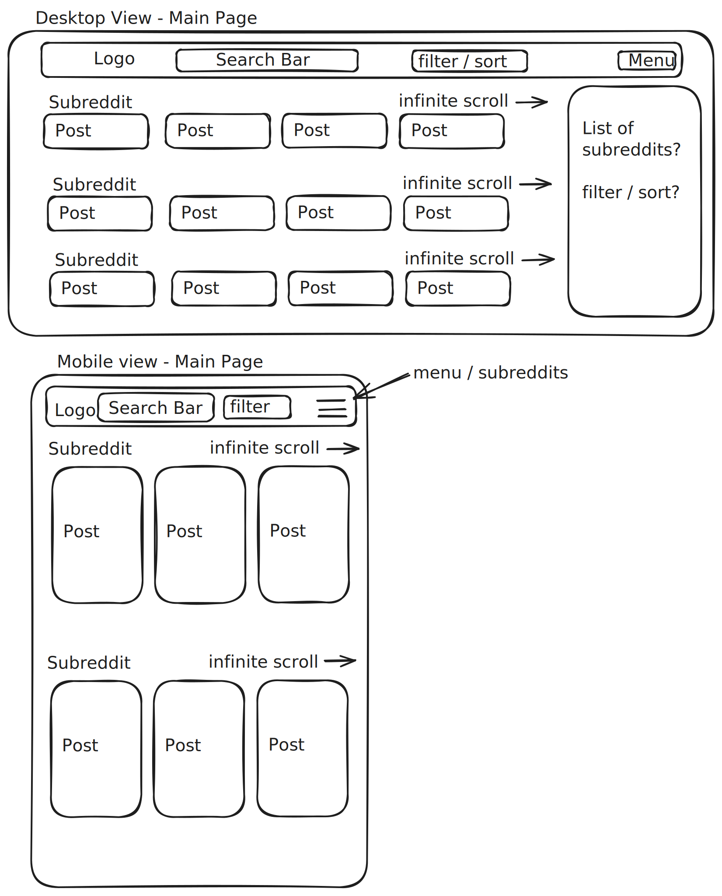

# Reddflix


A Netflix-style Reddit media browser. Browse posts by subreddit and read threaded comments — all in a clean, Netflix-themed interface.

Built as a portfolio project. The work I'm proudest of is the rate-limiting protocol, the response cache, and the UX details that keep scrolling and media smooth.

---

## About the Live Demo

The deployed instance runs with a deliberately low rate limit — **2 requests per 15 seconds** — so the rate limiter and cache layers are observable in normal use and also in tests.

If you hit a "Retrying in Xs" countdown after a few requests, that's the limiter working as designed. Wait for the countdown, watch the request go through automatically with its reserved slot, and the cache will serve the same data instantly for the next hour.

## A Note on Live Data

Reddit applies stricter limits and aggressive bot detection to traffic from server IPs, and may block proxies for extended periods. When that happens, the deployed instance serves data from a pre-scraped fallback dataset so the UI keeps working. The rate limiter, cache, and ban-handling code paths remain observable in the codebase and test suite (see [Testing](#testing)).

---

## Features

- Fetches Reddit's public JSON API through a custom Express proxy
- Horizontal, per-subreddit row layout
- Lazy-loaded subreddit rows
- Seen-post tracking with unseen-first resorting
- 10-minute refresh cooldown per subreddit
- Threaded comments with collapse/expand, OP and OC labels
- Expandable post view with full-resolution media and comments
- HLS video playback on the post page
- GIFs rendered as `<video>`, mounted only when in viewport
- Share button — copy direct link to any post
- Reddit markdown rendered safely with DOMPurify
- IndexedDB-persisted RTK Query cache — instant reloads
- Client-side ban awareness, shared across in-flight requests
- Pre-scraped lazy-loaded fallback dataset so the UI always renders, even when Reddit bans the proxy's IP
- Backend rate limiter and response cache (see below)

---

## How the Rate Limiter Works

Reddit's public JSON API rate-limits at 10 requests per 60 seconds. The backend enforces its own limit and rejects requests that would cross the threshold _before_ they reach Reddit, protecting every client behind the proxy from a shared ban.

The limiter is configurable: it runs at 2 req / 15s on the live demo so the behavior is observable (see [About the Live Demo](#about-the-live-demo)).

### Slot reservations

When a request is rejected, the response includes:

- HTTP 429 with `Retry-After`
- A `slotToken` in the body — a future timestamp marking a reserved spot in the limiter's window

The client waits for the duration, then retries with `X-Slot-Token: <timestamp>` as a header. The server finds that timestamp in its `recent[]` array, swaps it for the current time, and lets the request through.

```ts
// rateLimiter.ts — the relevant case
if (timestamp !== undefined) {
	const idx = recent.findIndex((t) => t === timestamp);
	if (idx !== -1 && timestamp <= now) {
		recent.splice(idx, 1, now);
		return { ok: true };
	}
}
```

Without reservations, a client's eventual retry isn't recorded, so fresh requests can keep stealing the slot it's waiting for — retries can starve indefinitely. Reserving the slot when the 429 is issued holds the client's spot until it retries.

### Bans

403s use the same short-circuit pattern. The backend records the ban duration from Reddit's `Retry-After`, and subsequent requests get rejected at the guard until it expires — no wasted calls to Reddit, and no need to keep retrying just to confirm the ban is still in place.

On the client, the ban timestamp is stored in IndexedDB and rehydrated into a module-scoped variable before the app mounts, so it survives reloads and blocks concurrent requests synchronously.

## How the Cache Works

Reddit responses change slowly — a subreddit's hot listing or a post's comment tree rarely shift meaningfully within a few minutes. Caching means repeat requests skip Reddit entirely.

### TTL cache, lazy cleanup

The cache is a `Map` keyed by `req.originalUrl`, with a 5-minute default TTL. Each entry stores the raw response body as a string alongside its expiry:

```ts
const set = (key: string, body: string, ttlMs: number = 1000 * 60 * 5) => {
	store.set(key, { body, expiresAt: Date.now() + ttlMs });
};
```

Expired entries are dropped on read, not via a background sweep, which is fine for this traffic profile.

### Middleware order

```
cacheCheck → rateLimitGuard → handler
```

Cache hits skip the limiter entirely, so a saturated limiter can still serve cached responses. A cache hit returns in ~0.6ms versus ~793ms for a Reddit round-trip.

### Strings, not objects

The backend is a pass-through proxy and never reads the payload, so responses are stored and forwarded as strings — no parse-and-restringify on either end:

```ts
const body = await resp.text();
cache.set(originalUrl, body, ttlMs);
res.type("application/json").send(body);
```

## Persisted Cache Sanitization

RTK Query's cache is persisted to IndexedDB so a reload skips the network entirely — but persisted errors come along for the ride. A 9pm rate-limit error rehydrates 12 hours later as a stale error blocking the UI.

A redux-persist transform runs on each write to the queries cache. Stuck-pending entries are stripped, stale rejected errors are dropped (or flipped to fulfilled if they have cached data underneath), and live rate-limit errors with a future timestamp are preserved so the countdown resumes after refresh.

Sanitizing at persist-time means the working query stays as a normal subscription — no read-side filtering, no extra hooks.

## Fallback-First Data Strategy

Reddit can rate-limit or block proxy traffic for extended periods. Every subreddit ships with a pre-scraped JSON dataset, loaded on demand via Vite dynamic imports — only the subreddits a user actually views get pulled into the bundle.

Live data takes priority; fallback fills the gap until (or unless) the live fetch resolves. The refresh button fires the live fetch explicitly via `useLazyQuery` — no automatic background upgrade, since fallback exists for when the network can't be trusted.

## How Comments Are Built

Reddit's comment API returns a deeply nested tree with awkward shape: `replies` is either an empty string `""` when there are none, or `{ data: { children: [...] } }` when there are some. Comments themselves carry dozens of fields, only a handful of which the UI actually needs. The frontend reshapes all of this before anything renders.

### Recursive normalization

`formatCommentTree` walks the raw response and produces a clean recursive type. It strips unused fields, normalizes the `replies: "" | object` discriminator into a real array, and recurses into children. By the time the data hits the component, `replies` is always an array and the tree can be walked without defensive checks.

```ts
type RedditCommentFormatted = RefinedCommentBase & {
	replies: RedditCommentFormatted[];
};
```

### Threaded rendering

`<RecursiveComments>` renders the tree by recursing on itself, mirroring the data shape. Each level renders the comment card, then conditionally renders a nested `<RecursiveComments>` for its replies, with a Tailwind `border-l` to draw the threading line.

Collapse state lives in a single `Set<string>` of comment IDs at the thread root. Toggling a comment also collapses all its descendants — walked via a small DFS helper (`getDescendants`) so a collapse on a thread root doesn't leave orphaned-open replies underneath.

### OP and OC labels

- **OP** — the post author, flagged on any comment where `is_submitter === true`. Highlighted in green.
- **OC** — the original commenter of the current thread. Each top-level comment is its own thread, and its author is passed down recursively as the `oc` prop. Highlighted in purple.

## In-View Media Lifecycle

Reddit posts contain heavy media — videos, GIFs, high-res images — and a grid of ten subreddits with dozens of posts each will choke the browser if everything mounts at once. The app uses `react-intersection-observer` at two levels to keep work cheap as the user scrolls.

### Lazy subreddit rows

`ScrollContainer` waits until its row reaches 70% visibility before mounting `PostContainer`. The fetch fires on mount, so a user who never scrolls to row 8 never makes a request for that subreddit.

### GIFs are MP4s, mounted only when on screen

Reddit classifies animated `.gif` files as `post_hint=image`, but ships an MP4 version alongside. The type guard catches these and renders them as `<video>` — smaller payload, smoother scroll. The element only mounts when its card enters the viewport (with `preload="none"`), and a static preview image fills the slot otherwise so layout stays stable.

## Seen Posts

Posts the user scrolls past are tracked in IndexedDB. `PostContainer` partitions resolved data into seen/unseen buckets, sorts each by `created_utc` descending, and concatenates unseen-first — so new content surfaces without dropping seen posts. The split is one pass inside a `useMemo` keyed on data and seen-state.

A post counts as seen only after its card stays in view 200ms, so fast scroll-bys don't register.

## Refresh Cooldown

The refresh button has a 10-minute cooldown per subreddit. Each successful fetch writes a `lastUpdated` timestamp via `onQueryStarted`'s `.then` callback — failed fetches don't start the cooldown, so a rate-limited refresh doesn't lock the user out.

The countdown display ticks via `useMinuteClock`, a tiny `useSyncExternalStore` hook that shares one 30-second `setInterval` across every subscriber on the page. Cleaner than each `ScrollHeader` running its own interval, and proper concurrent-mode behavior out of the box.

---

## Architecture: Request Flow

```
Frontend (RTK Query customBaseQuery)
  → checks in-memory ban state
  → GET /r/:subreddit  or  /comments/:postId  (with optional X-Slot-Token header)
      │
      ├── cacheCheck middleware
      │     hit  → 200 from cache, skip rate limiter
      │     miss → continue
      │
      ├── rateLimitGuard middleware
      │     ok        → continue
      │     rateLimit → 429 + Retry-After + slotToken (frontend retries with token)
      │     ban       → 403 + Retry-After
      │
      └── proxyFetch → Reddit public JSON API
            429/403 → recordBan, propagate upstream
            200     → store in cache, return to client
```

---

## Stack

**Frontend**

- React 19 + TypeScript (Vite)
- Redux Toolkit — state management
- RTK Query — data fetching and cache
- Redux Persist + localForage — RTK cache persisted to IndexedDB
- React Router v7
- Tailwind CSS v3
- Framer Motion — animations
- HLS.js — video playback
- DOMPurify — safe HTML rendering for Reddit markdown
- Vitest + MSW + React Testing Library — unit, integration, and component tests

**Backend**

- Express 5 + TypeScript (tsx)
- Custom in-memory TTL cache — keyed by request URL, 5-minute default TTL
- Sliding window rate limiter with slot-token reservations — prevents exceeding Reddit's API limits and propagates 429s with retry metadata to the client
- CORS — configurable allowed origins via `ALLOWED_ORIGINS` env var
- Morgan — request logging
- Vitest + Supertest — unit and integration tests
- GitHub Actions — CI on every push
- Railway — hosted with CD on main

## Testing

**Backend** — 33 tests (Vitest + Supertest)

- Unit: cache, rate limiter
- Integration: full request flow with mocked Reddit, slot-token round-trips, 429/403 propagation

**Frontend** — 17 tests (Vitest + MSW + React Testing Library)

- customBaseQuery integration: 403 ban handling, 429 rate-limit shape, Retry-After: 0 fallback, ban short-circuit
- sanitizeQueries transform: persistence path coverage
- QueryErrorMessage component: render branches for ban/rate-limit/generic across inline+panel variants

**CI** — GitHub Actions on every push and PR (backend; frontend CI pending)

---

## Project Structure

```
reddflix/
├── frontend/          # React SPA
│   └── src/
│       ├── app/			  # Redux store config (store.ts, sanitizeQueries.ts)
│       ├── features/
│       │   ├── reddit/       # RTK Query API, types, post components
│       │   └── localApp/     # IndexedDB CRUD via RTK Query
│       ├── components/       # UI: scroll rows, modals, media renderers
│       ├── hooks/            # Custom hooks (useMinuteClock)
│       ├── pages/            # Route-level components + app bootstrap
|       ├── test/             # MSW server, setup, render helper
│       └── utils/            # Router, IndexedDB wrapper, helpers
└── backend/           # Express proxy
    └── src/
        ├── lib/              # cache.ts, rateLimiter.ts, proxyFetch.ts, logger.ts
        ├── middleware/       # cacheCheck.ts, rateLimitGuard.ts
        └── routes/           # posts.ts, comments.ts
```

---

## Wireframe



---

## Getting Started

### Backend

```bash
cd backend
npm install
npm run dev        # tsx watch on port 3001
```

| Command                 | Description                       |
| ----------------------- | --------------------------------- |
| `npm run dev`           | Start with hot-reload (tsx watch) |
| `npm run build`         | Compile TypeScript                |
| `npm start`             | Run compiled output               |
| `npm test`              | Run Vitest in watch mode          |
| `npm run test:run`      | Run Vitest once                   |
| `npm run test:coverage` | Coverage report                   |

**Environment variables** (`.env`):

| Variable          | Description                                  |
| ----------------- | -------------------------------------------- |
| `PORT`            | Server port (default `3001`)                 |
| `ALLOWED_ORIGINS` | Comma-separated list of allowed CORS origins |

### Frontend

```bash
cd frontend
npm install
npm run dev
```

| Command           | Description                          |
| ----------------- | ------------------------------------ |
| `npm run dev`     | Start the Vite dev server            |
| `npm run build`   | Type-check and build for production  |
| `npm run lint`    | Run ESLint                           |
| `npm run preview` | Preview the production build locally |
| `npm test`        | Run Vitest unit tests                |

**Environment variables** (`.env`):

| Variable       | Description              |
| -------------- | ------------------------ |
| `VITE_API_URL` | Backend URL (production) |

---

## Author

**Michael Cristofaro**

- [LinkedIn](www.linkedin.com/in/michael-cristofaro-a4695740a)
- [Email](mikecris89@icloud.com)
